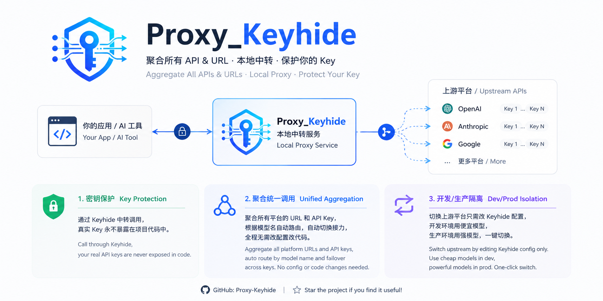

<div align="center">



<h1>🔑 Keyhide</h1>

<h3>Local AI Relay & API Key Protection Service</h3>

<h3>本地 AI 中转服务 · API 密钥保护 · 多平台聚合代理</h3>

[](LICENSE)
[](https://github.com/relliex/Proxy_Keyhide/releases)
[](https://www.electronjs.org)
[](https://github.com/relliex/Proxy_Keyhide/releases)

</div>

---

## 📖 目录 / Table of Contents

- [中文说明](#中文说明)
- [English Documentation](#english-documentation)

---

## 中文说明

### 这是什么？

Keyhide 是一个运行在本地的 AI 中转代理服务。它为你生成一组**伪装的 URL 和 API Key**，你的开发项目使用这组伪装凭证调用 Keyhide，Keyhide 再转发请求到你真实的上游 AI 平台（OpenAI、Anthropic 或任何兼容的中转站）。

**核心价值**：当你把项目上传到 GitHub 时，代码里只有伪装凭证，真实的 API Key 永远留在本地，不会泄露。

### 🎯 适用场景

| 场景                     | 说明                                                                                                                                          |
| ------------------------ | --------------------------------------------------------------------------------------------------------------------------------------------- |
| **密钥保护**       | 开发 AI 应用或使用需要外接 URL 与 API Key 的 AI 工具时，通过 Keyhide 中转调用，真实 Key 永不暴露在项目代码中                                  |
| **聚合统一调用**   | 将所有平台的 URL 和 API Key 聚合到本地统一入口，Keyhide 根据模型名自动路由到对应平台，单平台多 Key 额度用完自动接力切换，全程无需改配置改代码 |
| **开发/生产隔离**  | 切换上游平台只需改 Keyhide 配置，无需修改应用代码，开发环境用便宜模型、生产环境用强模型一键切换                                               |
| **请求日志与监控** | 自动记录每次调用的耗时、Token 用量、成功/失败状态，方便排查问题和统计成本                                                                     |

### ✨ 功能特性

| 功能                    | 说明                                                                                                     |
| ----------------------- | -------------------------------------------------------------------------------------------------------- |
| **密钥保护**      | 生成伪装 URL 和 API Key，真实密钥永不暴露给项目代码                                                      |
| **多平台聚合**    | 同时接入多个 AI 平台（OpenAI / Anthropic / 自定义），统一入口                                            |
| **多 Key 轮询**   | 单个平台配置多个 Key，支持轮询 / 优先级 / 加权 / 随机策略                                                |
| **自动故障转移**  | Key 报错或超时自动切换到下一个可用 Key，可选自动禁用故障 Key                                             |
| **额度耗尽检测**  | 429 状态码自动标记 Key 为已耗尽，跳过使用                                                                |
| **全格式兼容**    | 支持 OpenAI 和 Anthropic 全部 API 端点（Chat、Embeddings、Images、Audio、Files、Assistants、Threads 等） |
| **流式响应**      | 完整支持 SSE 流式转发，兼容 ChatGPT 流式调用                                                             |
| **加密存储**      | 所有配置数据加密存储，与机器绑定，文件被拷走也无法解密                                                      |
| **模型列表**      | 自动获取上游模型列表，支持搜索和一键复制                                                                 |
| **请求日志**      | 记录每次请求的状态、耗时、Token 用量，支持筛选和统计                                                     |
| **数据管理**      | 支持重置统计数据和清除所有数据，灵活管理本地存储                                                         |
| **批量 Key 操作** | 一键全部启用 / 禁用某个平台的所有 Key                                                                    |

### 🚀 快速上手

#### 方式一：下载安装包（推荐普通用户）

1. 前往 [Releases](../../releases) 页面下载最新版本
2. 运行 `Keyhide Setup 1.0.0.exe` 安装，或使用 `Keyhide-Portable-1.0.0.exe` 免安装运行
3. 打开 Keyhide，进入「上游平台」页面
4. 点击「添加平台」，填写：
   - **平台名称**：例如 `OpenAI 官方`
   - **平台类型**：选择 `OpenAI 格式` 或 `Anthropic 格式`
   - **Base URL**：例如 `https://api.openai.com`（不需要带 `/v1`）
   - **API Key**：填入你的真实 Key
5. 点击「获取模型」拉取可用模型列表
6. 进入「代理服务」页面，启动代理服务
7. 复制**伪装 URL** 和**伪装 API Key**，用它们替换你项目中的真实凭证

#### 方式二：从源码构建（推荐开发者）

```bash
# 1. 克隆仓库
git clone https://github.com/relliex/Proxy_Keyhide.git
cd Proxy_Keyhide

# 2. 安装依赖
npm install

# 3. 开发模式运行
npm run dev

# 4. 打包构建
npm run build:win    # Windows
npm run build:mac    # macOS
npm run build:linux  # Linux
```

### 🛠 在项目中使用

配置好 Keyhide 后，只需把项目中的 API 配置改为伪装凭证：

**Python (OpenAI SDK)**

```python
from openai import OpenAI

client = OpenAI(
    api_key="sk-keyhide-xxxxxxxxxxxx",  # Keyhide 生成的伪装 Key
    base_url="http://127.0.0.1:7860/v1"  # Keyhide 的本地地址
)

response = client.chat.completions.create(
    model="gpt-4o",
    messages=[{"role": "user", "content": "Hello!"}]
)
```

**Python (Anthropic SDK)**

```python
from anthropic import Anthropic

client = Anthropic(
    api_key="sk-keyhide-xxxxxxxxxxxx",
    base_url="http://127.0.0.1:7860"
)

message = client.messages.create(
    model="claude-sonnet-4-20250514",
    max_tokens=1024,
    messages=[{"role": "user", "content": "Hello!"}]
)
```

**Node.js**

```javascript
import OpenAI from 'openai'

const client = new OpenAI({
  apiKey: 'sk-keyhide-xxxxxxxxxxxx',
  baseURL: 'http://127.0.0.1:7860/v1'
})
```

### ⚙️ 高级配置

#### 路由模式

| 模式                        | 说明                                               |
| --------------------------- | -------------------------------------------------- |
| **自动 (auto)**       | 优先使用默认平台，若不支持该模型则自动查找其他平台 |
| **按模型 (by-model)** | 严格根据模型名查找支持该模型的平台                 |
| **按路径 (by-path)**  | 所有请求都使用默认平台                             |

你也可以在请求路径中指定平台：`http://127.0.0.1:7860/{platformId}/v1/chat/completions`

#### 容错配置

- **出错自动禁用 Key**：开启后，当 Key 请求超时或返回错误时立即禁用该 Key
- 被禁用的 Key 可在「上游平台」页面手动重新启用

#### 数据存储位置

所有配置数据加密存储在本地，与机器绑定。

数据与机器绑定，即使文件被复制到其他电脑也无法解密。

### 🏗 技术栈

- **Electron 31** — 跨平台桌面应用框架
- **React 18 + TypeScript** — 前端 UI
- **Vite 5** — 构建工具
- **Fastify 4** — HTTP 代理服务器
- **Tailwind CSS 3** — 样式
- **Zustand** — 状态管理

### 📁 项目结构

```
Proxy_Keyhide/
├── electron/
│   ├── main/
│   │   ├── database.ts       # 数据存储
│   │   ├── proxy-server.ts   # 代理服务器（Fastify）
│   │   ├── ipc.ts            # IPC 通信
│   │   ├── window.ts         # 窗口管理
│   │   ├── index.ts          # 主进程入口
│   │   └── upstream/
│   │       └── manager.ts    # 负载均衡与故障转移
│   ├── preload/
│   │   └── index.ts          # 预加载脚本
│   └── shared/
│       └── types.ts          # 共享类型定义
├── src/
│   ├── components/            # UI 组件
│   ├── pages/                 # 页面（Dashboard/Platforms/Proxy/Logs/Settings）
│   ├── stores/                # Zustand 状态管理
│   └── main.tsx               # 渲染进程入口
├── resources/
│   └── icon.png               # 应用图标
└── package.json
```

### 🔒 安全说明

- 默认绑定 `127.0.0.1`，**仅本机访问**，不暴露到公网
- 所有数据加密存储，与机器绑定，文件被拷走也无法解密
- 伪装 API Key 仅存在于本地加密文件中
- 上游真实 Key 不会通过代理响应泄露给调用方

> ⚠️ 如果将监听地址改为 `0.0.0.0` 以共享给局域网，请注意 API Key 会以 HTTP 明文传输，建议配合防火墙使用。

### 📄 许可证

[MIT License](LICENSE)

---

## English Documentation

### What is this?

Keyhide is a local AI relay proxy service. It generates a pair of **masked URL and API Key** for your development projects. Your projects use these masked credentials to call Keyhide, which then forwards requests to your real upstream AI platforms (OpenAI, Anthropic, or any compatible relay service).

**Core value**: When you upload your project to GitHub, the code only contains masked credentials — your real API keys never leave your local machine.

### 🎯 Use Cases

| Use Case                               | Description                                                                                                                                                                                                                                |
| -------------------------------------- | ------------------------------------------------------------------------------------------------------------------------------------------------------------------------------------------------------------------------------------------ |
| **Key Protection**               | When developing AI apps or using AI tools that require external URL and API key, relay through Keyhide to keep your real keys out of project code                                                                                          |
| **Unified Aggregation**          | Aggregate all platform URLs and API keys into a single local entry point. Keyhide auto-routes requests to the correct platform by model name, and auto-relays across multiple keys when quota runs out — no config or code changes needed |
| **Dev/Prod Isolation**           | Switch upstream platforms by simply changing Keyhide config — no code changes needed. Use cheap models in dev, powerful models in prod with one click                                                                                     |
| **Request Logging & Monitoring** | Automatically records duration, token usage, and success/failure status for each call — easy debugging and cost tracking                                                                                                                  |

### ✨ Features

| Feature                          | Description                                                                                                         |
| -------------------------------- | ------------------------------------------------------------------------------------------------------------------- |
| **Key Protection**         | Generates masked URL and API Key; real keys are never exposed to project code                                       |
| **Multi-Platform**         | Connect multiple AI platforms (OpenAI / Anthropic / custom) with a unified entry point                              |
| **Multi-Key Rotation**     | Configure multiple keys per platform with round-robin / priority / weighted / random strategies                     |
| **Auto Failover**          | Automatically switches to the next available key on errors or timeouts; optionally auto-disables faulty keys        |
| **Quota Detection**        | Automatically marks keys as exhausted on 429 status and skips them                                                  |
| **Full API Compatibility** | Supports all OpenAI and Anthropic API endpoints (Chat, Embeddings, Images, Audio, Files, Assistants, Threads, etc.) |
| **Streaming Support**      | Full SSE streaming passthrough, compatible with ChatGPT-style streaming calls                                       |
| **Encrypted Storage**      | All configuration data encrypted and machine-bound — files cannot be decrypted even if copied                          |
| **Model List**             | Auto-fetches upstream model lists with search and one-click copy                                                    |
| **Request Logging**        | Records status, duration, and token usage for each request with filtering and statistics                            |
| **Data Management**        | Reset statistics or clear all data with confirmation dialogs                                                        |
| **Bulk Key Operations**    | Enable / disable all keys for a platform with one click                                                             |

### 🚀 Quick Start

#### Option 1: Download Installer (Recommended for users)

1. Go to the [Releases](../../releases) page and download the latest version
2. Run `Keyhide Setup 1.0.0.exe` to install, or use `Keyhide-Portable-1.0.0.exe` for portable mode
3. Open Keyhide and navigate to the **Upstream Platforms** page
4. Click **Add Platform** and fill in:
   - **Platform Name**: e.g., `OpenAI Official`
   - **Platform Type**: Select `OpenAI Format` or `Anthropic Format`
   - **Base URL**: e.g., `https://api.openai.com` (no `/v1` suffix needed)
   - **API Key**: Enter your real key
5. Click **Fetch Models** to retrieve available models
6. Go to the **Proxy Service** page and start the proxy
7. Copy the **masked URL** and **masked API Key** — use them to replace real credentials in your project

#### Option 2: Build from Source (Recommended for developers)

```bash
# 1. Clone the repository
git clone https://github.com/relliex/Proxy_Keyhide.git
cd Proxy_Keyhide

# 2. Install dependencies
npm install

# 3. Run in development mode
npm run dev

# 4. Build and package
npm run build:win    # Windows
npm run build:mac    # macOS
npm run build:linux  # Linux
```

### 🛠 Usage in Your Projects

After configuring Keyhide, simply replace your project's API credentials with the masked ones:

**Python (OpenAI SDK)**

```python
from openai import OpenAI

client = OpenAI(
    api_key="sk-keyhide-xxxxxxxxxxxx",  # Masked key from Keyhide
    base_url="http://127.0.0.1:7860/v1"  # Keyhide local address
)

response = client.chat.completions.create(
    model="gpt-4o",
    messages=[{"role": "user", "content": "Hello!"}]
)
```

**Python (Anthropic SDK)**

```python
from anthropic import Anthropic

client = Anthropic(
    api_key="sk-keyhide-xxxxxxxxxxxx",
    base_url="http://127.0.0.1:7860"
)

message = client.messages.create(
    model="claude-sonnet-4-20250514",
    max_tokens=1024,
    messages=[{"role": "user", "content": "Hello!"}]
)
```

**Node.js**

```javascript
import OpenAI from 'openai'

const client = new OpenAI({
  apiKey: 'sk-keyhide-xxxxxxxxxxxx',
  baseURL: 'http://127.0.0.1:7860/v1'
})
```

### ⚙️ Advanced Configuration

#### Routing Modes

| Mode               | Description                                                                         |
| ------------------ | ----------------------------------------------------------------------------------- |
| **Auto**     | Uses default platform first; auto-finds other platforms if the model is unsupported |
| **By Model** | Strictly finds platforms that support the requested model                           |
| **By Path**  | All requests use the default platform                                               |

You can also specify a platform in the request path: `http://127.0.0.1:7860/{platformId}/v1/chat/completions`

#### Fault Tolerance

- **Auto-disable Key on Error**: When enabled, keys are immediately disabled on timeout or error responses
- Disabled keys can be manually re-enabled in the **Upstream Platforms** page

#### Data Storage Location

All configuration data is encrypted and stored locally, machine-bound.

Data is machine-bound — even if files are copied to another computer, they cannot be decrypted.

### 🏗 Tech Stack

- **Electron 31** — Cross-platform desktop framework
- **React 18 + TypeScript** — Frontend UI
- **Vite 5** — Build tool
- **Fastify 4** — HTTP proxy server
- **Tailwind CSS 3** — Styling
- **Zustand** — State management

### 📁 Project Structure

```
Proxy_Keyhide/
├── electron/
│   ├── main/
│   │   ├── database.ts       # Data storage
│   │   ├── proxy-server.ts   # Proxy server (Fastify)
│   │   ├── ipc.ts            # IPC communication
│   │   ├── window.ts         # Window management
│   │   ├── index.ts          # Main process entry
│   │   └── upstream/
│   │       └── manager.ts    # Load balancing & failover
│   ├── preload/
│   │   └── index.ts          # Preload script
│   └── shared/
│       └── types.ts          # Shared type definitions
├── src/
│   ├── components/            # UI components
│   ├── pages/                 # Pages (Dashboard/Platforms/Proxy/Logs/Settings)
│   ├── stores/                # Zustand state management
│   └── main.tsx               # Renderer process entry
├── resources/
│   └── icon.png               # App icon
└── package.json
```

### 🔒 Security Notes

- Binds to `127.0.0.1` by default — **localhost only**, not exposed to the public internet
- All data encrypted and machine-bound — files cannot be decrypted even if copied
- Masked API Key exists only in the local encrypted file
- Upstream real keys are never leaked through proxy responses

> ⚠️ If you change the listen address to `0.0.0.0` to share with your LAN, note that API keys will be transmitted in HTTP plaintext. Use with firewall protection.

### 📄 License

[MIT License](LICENSE)

---

<div align="center">

**Made with care for developers who value security.**

</div>
